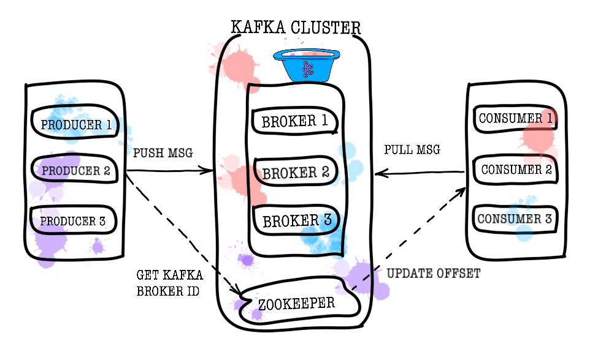
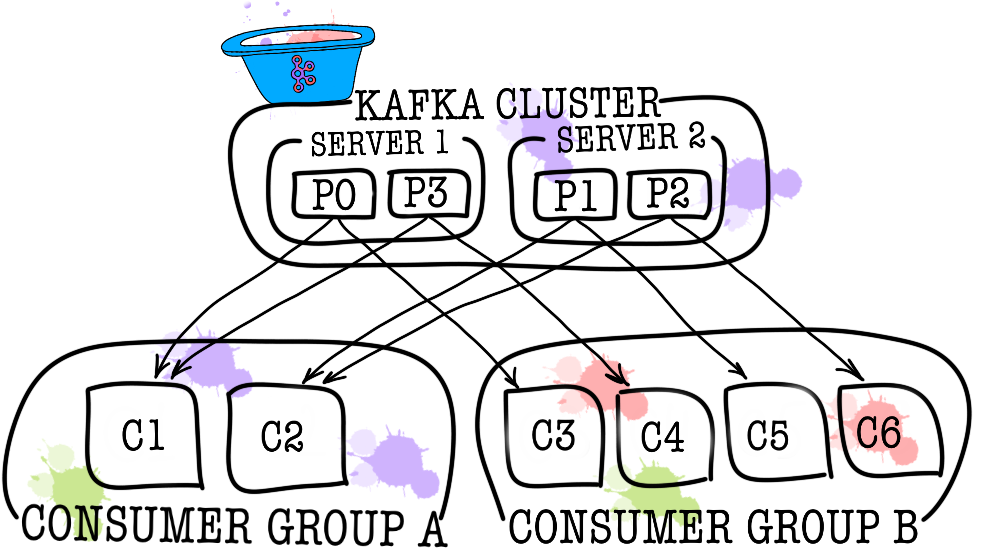

[Вопросы для собеседования](../README.md)

# Kafka

+ [Общий обзор `Kafka`](#общий-обзор-kafka)
+ [Что такое Kafka?](#Что-такое-Kafka)
+ [Что такое традиционный метод обмена сообщениями?](#Что-такое-традиционный-метод-обмена-сообщениями)
+ [Как реализовать гарантированную доставку в Кафке?](#Как-реализовать-гарантированную-доставку-в-Кафке)
+ [Какие-преимущества-у-Kafka-перед-традиционными-технологиями?](#какие-преимущества-у-Kafka-перед-традиционными-технологиями)
+ [Что в Кафке означает брокер?](#Что-в-Кафке-означает-брокер)
+ [Какую максимальную информацию может получить сервер Kafka?](#Какую-максимальную-информацию-может-получить-сервер-Kafka)
+ [Что такое Zookeeper от Kafka? Можно ли использовать Kafka без Zookeeper?](#что-такое-Zookeeper-от-Kafka?-Можно-ли-использовать-Kafka-без-Zookeeper)

## Общий обзор `Kafka`

#### Проблема

Одна из проблем с большим числом сервисов — коммуникации. Сервис А часто хочет узнать информацию, которой располагает 
сервис Б. В этом случае сервис А обращается к сервису Б через синхронный API. Сервис В хочет знать, что происходит у 
сервисов Г и Д, а те, в свою очередь, интересуются сервисами А и Б. Когда таких «любопытных» сервисов становится много, 
связи между ними превращаются в запутанный клубок.

#### Требования

* сообщения между сервисами не должны теряться;
  

* сообщения могут дублироваться;
  

* сообщения можно хранить и читать на глубину в несколько дней (персистентный буфер);
  

* сервисы могут подписаться на интересующие их данные;
  

* несколько сервисов могут читать одни и те же данные;
  

* иногда нужна гарантия порядка сообщений.

Выбор очевиден это `КАФКА`

Базовая топология Kafka состоит из `producer`, `consumer`, `broker` и `zookeeper`.

#### Broker

За хранение ваших данных отвечает брокер (broker). Все данные хранятся в бинарном виде, и брокер мало знает про то,
что они из себя представляют, и какова их структура.

Каждый логический тип событий обычно находится в своем отдельном топике (topic). Например, событие создания объявления
может попадать в топик item.created, а событие его изменения — в item.changed. Топики можно рассматривать как 
классификаторы событий. На уровне топика можно задать такие конфигурационные параметры, как:

* объем хранимых данных и/или их возраст (retention.bytes, retention.ms);
  

* фактор избыточности данных (replication factor);
  

* максимальный размер одного сообщения (max.message.bytes);
  

* минимальное число согласованных реплик, при котором в топик можно будет записать данные (min.insync.replicas);
  

* возможность провести failover на не синхронную отстающую реплику с потенциальной потерей данных
  (unclean.leader.election.enable);
  

* и еще много других (https://kafka.apache.org/documentation/#topicconfigs).

В свою очередь каждый топик разбивается на одну и более партицию (partition). Именно в партиции в итоге попадают события.
Если в кластере более одного брокера, то партиции будут распределены по всем брокерам равномерно (насколько это возможно),
что позволит масштабировать нагрузку на запись и чтение в один топик сразу на несколько брокеров.

На диске данные для каждой партиции хранятся в виде файлов сегментов, по умолчанию равных одному гигабайту 
(контролируется через log.segment.bytes). Важная особенность — удаление данных из партиций (при срабатывании retention)
происходит как раз сегментами (нельзя удалить одно событие из партиции, можно удалить только целый сегмент, причем только
неактивный).

#### Zookeeper

Zookeeper выполняет роль хранилища метаданных и координатора. Именно он способен сказать, живы ли брокеры (посмотреть 
на это глазами zookeeper можно через zookeeper-shell командой ls /brokers/ids), какой из брокеров является контроллером
(get /controller), находятся ли партиции в синхронном состоянии со своими репликами 
(get /brokers/topics/topic_name/partitions/partition_number/state). Также именно к zookeeper сперва пойдут producer и 
consumer чтобы узнать, на каком брокере какие топики и партиции хранятся. В случаях, когда для топика задан replication
factor больше 1, zookeeper укажет, какие партиции являются лидерами (в них будет производиться запись и из них же будет
идти чтение). В случае падения брокера именно в zookeeper будет записана информация о новых лидер-партициях
(с версии 1.1.0 асинхронно, и это важно).

В более старых версиях Kafka zookeeper отвечал и за хранение оффсетов, но сейчас они хранятся в специальном топике 
__consumer_offsets на брокере (хотя вы можете по-прежнему использовать zookeeper для этих целей).

#### Producer

Producer — это чаще всего сервис, осуществляющий непосредственную запись данных в Apache Kafka. Producer выбирает topic,
в котором будут храниться его тематические сообщения, и начинает записывать в него информацию. Например, producer’ом 
может быть сервис объявлений. В таком случае он будет отправлять в тематические топики такие события, как «объявление 
создано», «объявление обновлено», «объявление удалено» и т.д. Каждое событие при этом представляет собой пару
ключ-значение.

По умолчанию все события распределяются по партициям топика round-robin`ом, если ключ не задан (теряя упорядоченность) 
и через MurmurHash (ключ), если ключ присутствует (упорядоченность в рамках одной партиции).

Здесь сразу стоит отметить, что Kafka гарантирует порядок событий только в рамках одной партиции. Но на самом деле часто 
это не является проблемой. Например, можно гарантированно добавлять все изменения одного и того же объявления в одну 
партицию (тем самым сохраняя порядок этих изменений в рамках объявления). Также можно передавать порядковый номер в 
одном из полей события.

#### Consumer

Consumer отвечает за получение данных из Apache Kafka. Если вернуться к примеру выше, consumer’ом может быть сервис
модерации. Этот сервис будет подписан на топик сервиса объявлений и при появление нового объявления будет получать 
его и анализировать на соответствие некоторым заданным политикам.

Apache Kafka запоминает, какие последние события получил consumer (для этого используется служебный топик 
__consumer__offsets), тем самым гарантируя, что при успешном чтении consumer не получит одно и то же сообщение дважды. 
Тем не менее, если использовать опцию enable.auto.commit = true и полностью отдать работу по отслеживанию положения
consumer’а в топике на откуп Кафке, можно потерять данные. В продакшен коде чаще всего положение консьюмера 
контролируется вручную (разработчик управляет моментом, когда обязательно должен произойти commit прочитанного события).

В тех случаях, когда одного consumer недостаточно (например, поток новых событий очень большой), можно добавить еще 
несколько consumer, связав их вместе в consumer group. Consumer group логически представляет из себя точно такой же 
consumer, но с распределением данных между участниками группы. Это позволяет каждому из участников взять свою долю 
сообщений, тем самым масштабируя скорость чтения.

Взято от сюда (https://temofeev.ru/info/articles/kafka-i-mikroservisy-obzor/)

[к оглавлению](#Kafka)

##  Что такое `Kafka`?

`Kafka` - это система обмена сообщениями публикация-подписка, разработанная Apache. Это распределенная, секционированная 
и повторяющаяся служба журналов.

[к оглавлению](#Kafka)

## Что такое традиционный метод обмена сообщениями?

Традиционные методы обмена сообщениями включают два:
* Очередь: в очереди группа пользователей может читать сообщения с сервера, и каждое сообщение отправляется одному из них.

* Публикация-подписка: в этой модели сообщения транслируются всем пользователям.

[к оглавлению](#Kafka)

## Как реализовать гарантированную доставку в Кафке

Гарантированная доставка сообщений в Apache Kafka может быть достигнута с помощью нескольких механизмов и настроек. Вот некоторые из них:

1. Аккуратная конфигурация параметров Kafka Producer:
- `acks` (подтверждение): Устанавливает требования по подтверждению записи сообщения. acks=all (или acks=-1) требует 
подтверждения от всех реплик ISR (In-Sync Replicas), что гарантирует надежную доставку.
- `retries` (повторы): Устанавливает количество попыток повторной отправки сообщения в случае неудачи
- `max.in.flight.requests.per.connection`  Устанавливает максимальное количество сообщений, которые могут быть в процессе 
отправки до получения подтверждения.

2. Использование транзакций:
- Если требуется атомарная отправка нескольких сообщений, можно использовать транзакции Kafka. Это обеспечивает 
атомарность отправки нескольких сообщений в пределах одной или нескольких тем.

3. Настройка параметров Kafka Consumer:
- Для обеспечения гарантированного чтения сообщений со стороны потребителя можно настроить параметры, такие как
`auto.offset.reset и enable.auto.commit`.

4. Репликация и ISR:
- Убедитесь, что параметры репликации и настройки ISR настроены таким образом, чтобы обеспечить надежность кластера Kafka.

5. Мониторинг и обработка ошибок:
- Необходимо регулярно мониторить состояние кластера Kafka и потребителей, а также обрабатывать любые ошибки, которые
могут возникнуть в процессе обработки сообщений.

6. Резервное копирование данных:
- Резервное копирование данных Kafka, включая журналы и снимки, также может быть важным компонентом стратегии гарантированной доставки.

[к оглавлению](#Kafka)

## Какие-преимущества-у-Kafka-перед-традиционными-технологиями?

Преимущества Apache Kafka по сравнению с традиционной технологией обмена сообщениями:

`Быстро`: один агент Kafka может обрабатывать тысячи клиентов, обрабатывая мегабайты операций чтения и записи в секунду.

`Масштабируемость`: разбиение и упрощение данных на наборе машин для поддержки больших объемов данных

`Постоянное`: сообщение является постоянным и реплицируется в кластере для предотвращения потери данных.

`Дизайн`: Гарантия отказоустойчивости и долговечность

[к оглавлению](#Kafka)

## Что в Кафке означает брокер?

В кластере Kafka термин брокер используется для обозначения сервера.

[к оглавлению](#Kafka)

## Какую максимальную информацию может получить сервер Kafka?

Максимальный размер сообщения, которое может получить сервер Kafka, определяется параметром message.max.bytes. 
Значение по умолчанию версии 010 - 1000012, которое можно настроить на уровне брокера или уровне темы.

[к оглавлению](#Kafka)

## Что такое Zookeeper от Kafka? Можно ли использовать Kafka без Zookeeper?

`Zookeeper` - это высокопроизводительная служба координации с открытым исходным кодом, которая используется в 
распределенных приложениях Kafka.

Нет, обойти Zookeeper и напрямую связаться с брокером Kafka невозможно. Когда Zookeeper перестает работать, он не может 
обслуживать клиентские запросы.

* Zookeeper в основном используется для связи между разными узлами в кластере.
  
* В Kafka он используется для фиксации смещения, поэтому, если узел в любом случае выйдет из строя, его можно получить 
  из ранее зафиксированного смещения.
  
* Кроме того, он также выполняет другие действия, такие как: обнаружение лидера, распределенная синхронизация, управление
  конфигурацией, определение того, когда новый узел покидает или подключается, кластер, состояние узла в реальном времени и т. Д.

[к оглавлению](#Kafka)

