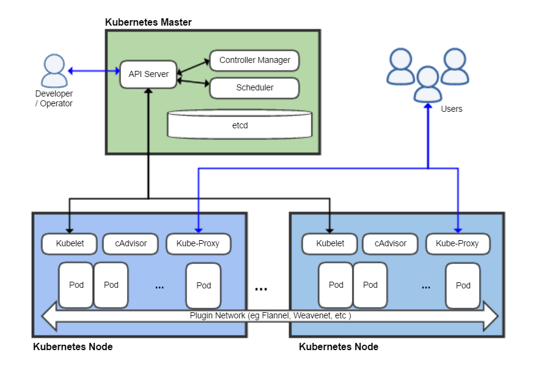
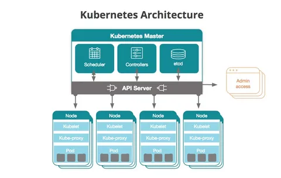

[Вопросы для собеседования](../README.md)

# Kubernetes

+ [Что такое Kubernetes?](#Что-такое-Kubernetes)
+ [Базовая концепции внутреннего устройства Kubernetes?](#Что-такое-Kubernetes)
+ [Архитектура Kubernetes](#Архитектура-Kubernetes)
+ [Кубер как поды создаются?](#Кубер-как-поды-создаются?)
+ [Кубер сайт кард что это?](java-interview/kuber.md#Кубер-сайт-кард-что-это?)


##  Что такое `Kubernetes`?

`Kubernetes` — это система управления контейнерами, разработанная на платформе Google. Цель kubernetes — управлять 
контейнерными приложениями в различных типах физических, виртуальных и облачных сред. Google Kubernetes — это очень
гибкий контейнерный инструмент для последовательной доставки даже сложных приложений. Приложения запускаются на кластерах
от сотен до тысяч отдельных серверов.

[к оглавлению](#Kubernetes)

## Базовая концепции внутреннего устройства Kubernetes

`Nodes (node.md)` – нода – это машина в кластере Kubernetes.

`Pods (pods.md)` – это группа контейнеров с общими разделами, запускаемые как единое целое.

`Replication Controllers (replication-controller.md)` – сервис, гарантирующий, что определённое количество «реплик» pod'ы будут запущены в любой момент времени.

`Services (services.md)` – ещё один сервис в Kubernetes – это абстракция, которая определяет логический объединённый набор pod и политику доступа к ним.

`Volumes (volumes.md)` – директория или раздел, возможно, с данными в ней, которая доступна в контейнере.

`Labels (labels.md)` – пары ключ/значение, которые прикрепляются к объектам, например, pod'ам. Label'ы могут быть использованы для создания и выбора наборов объектов.

`Kubectl Command Line Interface (kubectl.md)` – интерфейс командной строки для управления Kubernetes.


[к оглавлению](#Kubernetes)


## Архитектура Kubernetes

Работающий кластер Kubernetes включает в себя агента, запущенного на нодах (kubelet), и компоненты мастера 
(APIs, scheduler, etc) поверх решения с распределённым хранилищем.



Архитектура:

1. `Нода Kubernetes` – при взгляде на архитектуру системы мы можем разбить его на сервисы, которые работают на каждой ноде,
   и сервисы уровня управления кластера. На каждой ноде Kubernetes запускаются сервисы, необходимые для управления нодой 
   со стороны мастера и для запуска приложений. И, конечно, на каждой ноде запускается Docker. Docker обеспечивает 
   загрузку образов и запуск контейнеров.


2. `Kubelet – Kubelet` управляет pod'ами их контейнерами, образами, разделами.


3. `Kube-Proxy` – на каждой ноде запускается простой proxy-балансировщик. Этот сервис запускается на каждой ноде и
   настраивается в Kubernetes API. Kube-Proxy может выполнять простейшее перенаправление потоков TCP и UDP (round robin) 
   между набором бэкендов.


4. `Компоненты управления Kubernetes` – система управления Kubernetes разделена на несколько компонентов.
   4.1 Сервер хранения ключевой информации etcd – состояние мастера хранится в экземпляре etcd. Это обеспечивает надёжное
   хранение конфигурационных данных и своевременное оповещение прочих компонентов об изменении состояния.
   4.2 Kubernetes API Server – обеспечивает работу api-сервера. Он предназначен для того, чтобы быть CRUD-сервером со
   встроенной бизнес-логикой, реализованной в отдельных компонентах или в плагинах. Он, в основном, обрабатывает 
   REST-операции, проверяя их и обновляя соответствующие объекты в etcd (и событийно в других хранилищах).
   4.3 Scheduler – привязывает незапущенные pod'ы к нодам через вызов /binding API. Scheduler подключаем; планируется 
   поддержка множественных scheduler'ов и пользовательских scheduler'ов.


5. `Kubernetes Controller Manager Server` – все остальные функции уровня кластера представлены в Controller Manager. 
   Например, ноды обнаруживаются, управляются и контролируются средствами node controller. Эта сущность в итоге может 
   быть разделена на отдельные компоненты, чтобы сделать их независимо подключаемыми.




[к оглавлению](#Kubernetes)

## Кубер-как-поды-создаются?
В Kubernetes (K8s) поды создаются с использованием описаний подов, которые называются манифестами. Манифесты представляют
собой файлы конфигурации в формате YAML или JSON, которые описывают требования к поду, такие как контейнеры, образы Docker,
порты, ресурсы и другие параметры.

Вот пример манифеста YAML, который описывает простой под с одним контейнером:
```yaml
apiVersion: v1
kind: Pod
metadata:
  name: my-pod
spec:
  containers:
  - name: my-container
    image: nginx:latest
    ports:
    - containerPort: 80
```

Этот манифест определяет под с одним контейнером, который запускает веб-сервер Nginx на порту 80.

После создания манифеста пода, вы можете использовать утилиту kubectl для создания пода в кластере Kubernetes. Например, 
чтобы создать под на основе манифеста pod.yaml, используйте следующую команду:

_kubectl apply -f pod.yaml_

Kubernetes применит конфигурацию из файла pod.yaml и создаст под с указанными параметрами.

Вы также можете создавать поды динамически с помощью API Kubernetes, если у вас есть соответствующие права доступа и 
возможности на вашем кластере. Это может быть полезно в автоматизированных сценариях развертывания и управления ресурсами Kubernetes.

[к оглавлению](#Kubernetes)

## Кубер сайт кард что это?

"Кард" в контексте Kubernetes (K8s) обычно означает "конфигурация адаптивной реализации для всех узлов". Это означает, 
что это файл конфигурации, который указывает на параметры управления для всех узлов в кластере Kubernetes. Это может 
включать в себя такие параметры, как настройки kubelet (агента, работающего на узлах), настройки kube-proxy (для сетевого прокси)
и другие параметры, которые влияют на работу узлов Kubernetes.

Кард (или "Kubelet Configuration" в полном формате) обычно используется администраторами Kubernetes для определения настроек,
таких как каталоги хранения данных, адреса API-серверов и другие параметры конфигурации, которые должны быть применены ко всем узлам в кластере.

Подобно другим файлам конфигурации в Kubernetes, кард может быть представлен в формате YAML или JSON. Он может быть создан 
вручную администратором, а также может быть сгенерирован автоматически с использованием инструментов управления конфигурациями
или утилитами командной строки, такими как kubectl.

В общем, кард предоставляет администраторам Kubernetes гибкость и контроль над настройками узлов в кластере, что позволяет
им адаптировать их под свои потребности и обеспечивать более эффективное и управляемое окружение Kubernetes.