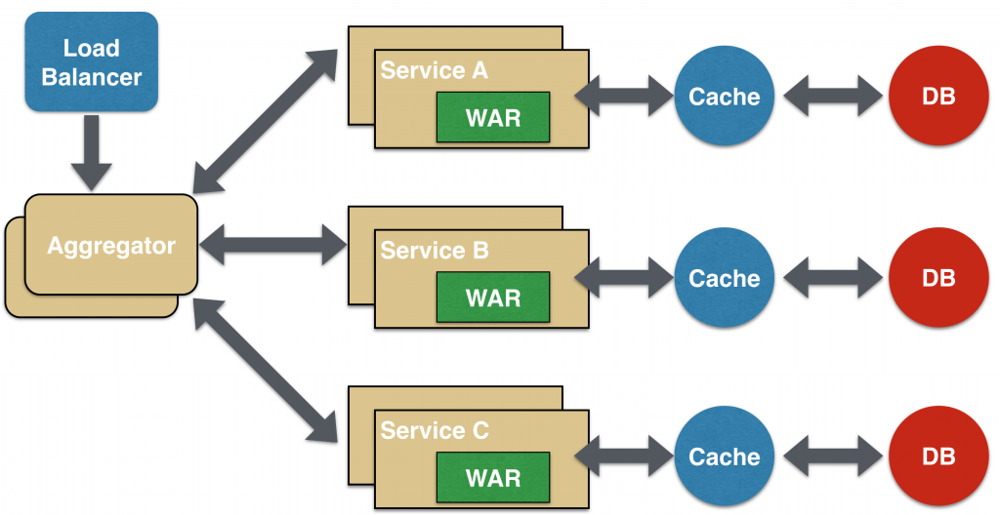
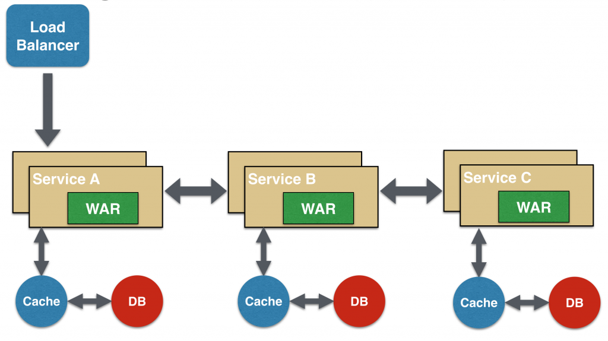

[Вопросы для собеседования](../README.md)

# Микросервисы
+ [Что характеризует МС](ms.md#Что-характеризует-МС)
+ [Какие есть плюсы и минусы микросервесно _архитектуры?_](ms.md#Какие-есть-плюсы-и-минусы-микросервесно-архитектуры)
+ [Паттерн Агрегатор (Aggregator)](#Паттерн-Агрегатор-Aggregator)
+ [Паттерн проектирования «Цепочка» (Chained)](#Паттерн-проектирования-Цепочка-Chained)

## Что характеризует МС
* Микро не значит что маленький это значит что их много
* МС должне быть автономен
* Изменения в МС должны минимально влиять на связанные с ним компоненты
* МС может быть свободно заменен на другой ЯП с соблюдением контрактов по API
* МС должен иметь свою БД

## Какие есть плюсы и минусы микросервесно архитектуры?

__ПЛЮСЫ:__

* Изменение в одном месте МС не ведут к необходимости редеплоя
* Порог вхождения в предметную область ниже
* Разграничение зон ответсвенности для разработки
* Тестирование облегчается
* В МС можно поменять ЯП
* Вертикальная и горизонтальная массштабируемость
* Код МС не связан с кодом другого МС
* Каждый МС имеет строгоограниченный функционал

__МИНУСЫ:__

* Требуется детальное проектирование архитектуры
* Низкая связанность данных (и плюс и минус)
* Возможность хранения в БД не консистентных данных
* Усложняется процесс CI / CD
* Увеличивается время на отладку межсервисных взаимодействий

Для создания качественной микросервисной архитектуры необходимо четко разделить функции в вашем приложении и команде. 
Так можно достичь слабого связывания (REST-интерфейсы) и сильного сцепления (множество сервисов могут компоноваться вместе, 
определяя более высокоуровневые сервисы или приложение). Функциональная декомпозиция обеспечивает гибкость, 
масштабируемость и прочие -ости.

## Паттерн Агрегатор (Aggregator)

Первый и, пожалуй, наиболее распространенный паттерн проектирования при работе с микросервисами — «агрегатор».

В простейшей форме агрегатор представляет собой обычную веб-страницу, вызывающую множество сервисов для реализации функционала, 
требуемого в приложении. Поскольку все сервисы (Service A, Service B и Service C) предоставляются при помощи легковесного 
REST-механизма, веб-страница может извлечь данные и обработать/отобразить их как нужно. Если требуется какая-либо обработка,
например, применить бизнес-логику к данным, полученным от отдельных сервисов, то для этого у вас может быть CDI-компонент, 
преобразующий данные таким образом, чтобы их можно было вывести на веб-странице

Агрегатор может использоваться и в тех случаях, когда не требуется ничего отображать, а нужен лишь более высокоуровневый 
составной микросервис, который могут потреблять другие сервисы. В данном случае агрегатор просто соберет данные от всех 
отдельных микросервисов, применит к ним бизнес-логику, а далее опубликует микросервис как конечную точку REST. В таком случае,
при необходимости, его смогут потреблять другие нуждающиеся в нем сервисы.

Этот паттерн следует принципу DRY. Если существует множество сервисов, которые должны обращаться к сервисам A, B и C, то
рекомендуется абстрагировать эту логику в составной микросервис и агрегировать ее в виде отдельного сервиса. Преимущество 
абстрагирования на этом уровне заключается в том, что отдельные сервисы, скажем, A, B и C, могут развиваться независимо, 
а бизнес-логику будет по-прежнему выполнять составной микросервис.

Обратите внимание: каждый отдельный микросервис (опционально) имеет собственные уровни кэширования и базы данных. Если
агрегатор – это составной микросервис, то и у него могут быть такие уровни.

Агрегатор также может независимо масштабироваться как по горизонтали, так и по вертикали. То есть, если речь идет о 
веб-странице, то к ней можно прикрутить дополнительные веб-серверы, а если это составной микросервис, использующий Java EE,
то к нему прикручиваются дополнительные экземпляры WildFly, позволяющие удовлетворить растущие потребности.

## Паттерн проектирования «Цепочка» (Chained)
Микросервисный паттерн проектирования «Цепочка» выдает единый консолидированный ответ на запрос. В данном случае сервис
A получает запрос от клиента, связывается с сервисом B, который, в свою очередь, может связаться с сервисом C. Все эти 
сервисы, скорее всего, будут обмениваться синхронными сообщениями «запрос/отклик» по протоколу HTTP.

Здесь важнее всего запомнить, что клиент блокируется до тех пор, пока не выполнится вся коммуникационная цепочка запросов 
и откликов, т.е. Service <-> Service B и Service B <-> Service C. Запрос от Service B к Service C может выглядеть совершенно 
иначе, нежели от Service A к Service B. Аналогично, отклик от Service B к Service A может принципиально отличаться от отклика 
Service C к Service B. Это наиболее важно во всех случаях, когда бизнес-ценность нескольких сервисов суммируется.

Здесь также важно понять, что нельзя делать цепочку слишком длинной. Это критично, поскольку цепочка синхронна по своей природе, 
и чем она длиннее, тем дольше придется ожидать клиенту, особенно если отклик заключается в выводе веб-страницы на экран. 
Существуют способы обойти такой блокирующий механизм запросов и откликов, и они рассматриваются в следующем паттерне.

Цепочка, состоящая из единственного микросервиса, называется «цепочка-одиночка». Впоследствии ее можно расширить.