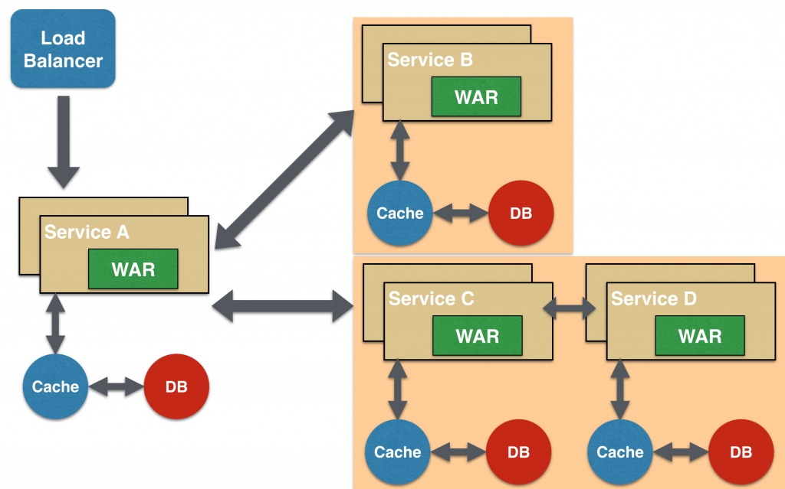
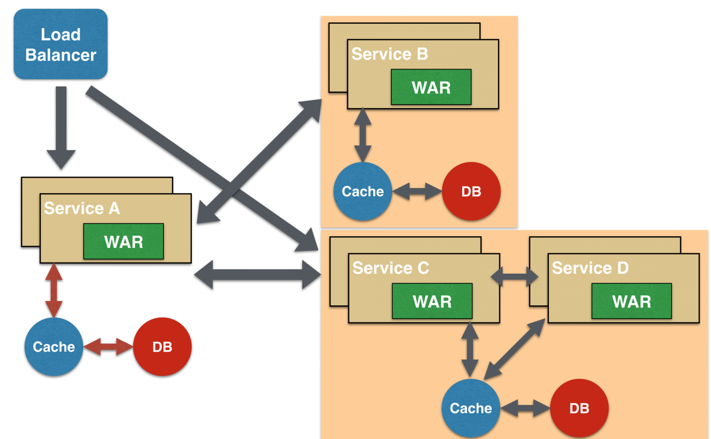
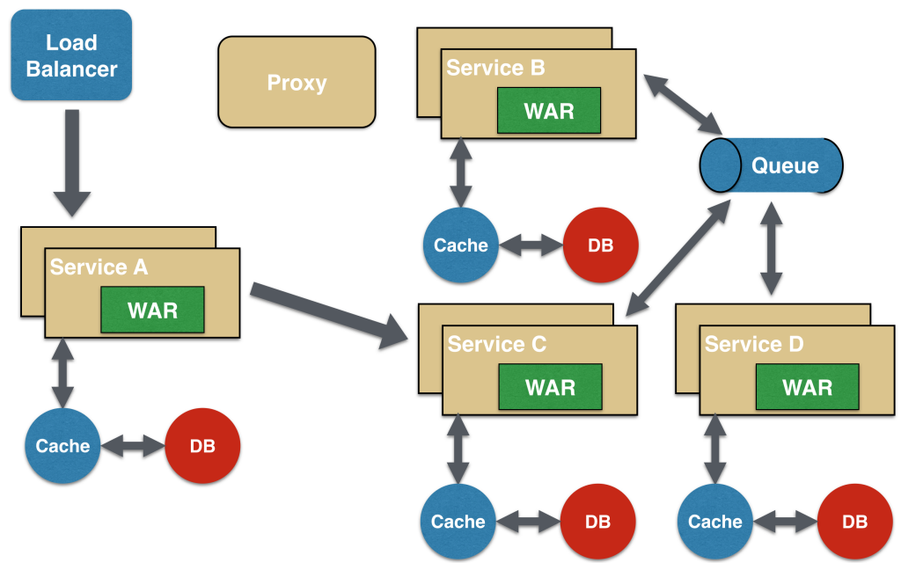
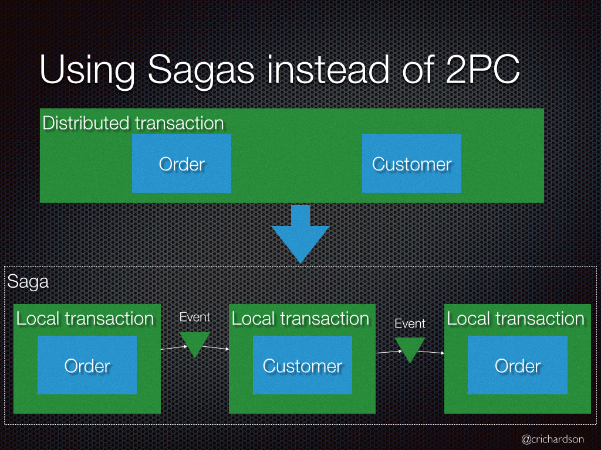
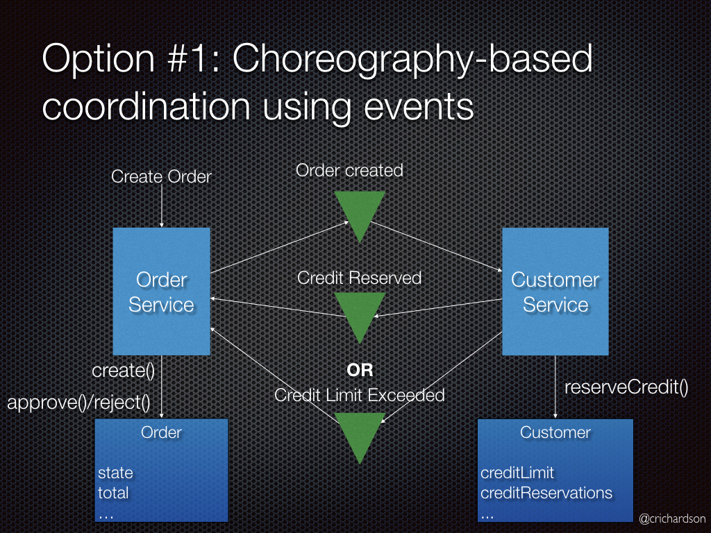
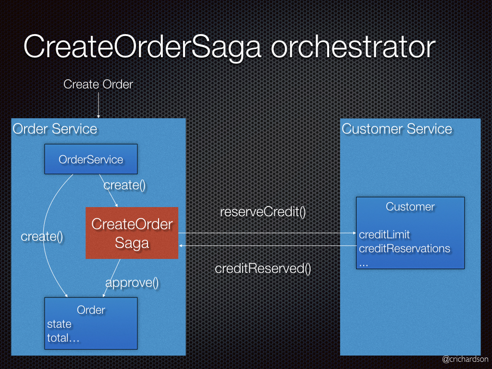
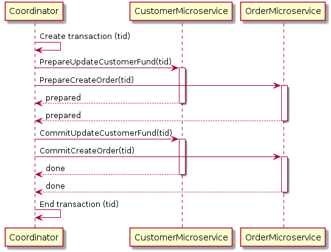
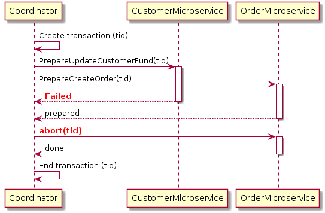

[Вопросы для собеседования](../README.md)

# Микросервисы
+ [Что характеризует МС](#Что-характеризует-МС)
+ [Какие есть плюсы и минусы микросервесно _архитектуры?_](#Какие-есть-плюсы-и-минусы-микросервесно-архитектуры)
+ [Паттерн Агрегатор (Aggregator)](#Паттерн-Агрегатор-Aggregator)
+ [Паттерн проектирования «Цепочка» (Chained)](#Паттерн-проектирования-Цепочка-Chained)
+ [Паттерн проектирования «Ветка» (Branch)](#Паттерн-проектирования-Ветка-Branch)
+ [Паттерн «Разделяемые данные» (Shared Data)](#Паттерн-Разделяемые-данные-Shared-Data)
+ [Паттерн «Асинхронные сообщения» (Asynchronous Messaging)](#Паттерн-Асинхронные-сообщения-Asynchronous-Messaging)
+ [Паттерн Saga](#Паттерн-Saga)
+ [Двух фазный коммит](#Двух-фазный-коммит)

## Что характеризует МС
* Микро не значит что маленький это значит что их много
* МС должне быть автономен
* Изменения в МС должны минимально влиять на связанные с ним компоненты
* МС может быть свободно заменен на другой ЯП с соблюдением контрактов по API
* МС должен иметь свою БД

[к оглавлению](#Микросервисы)

## Какие есть плюсы и минусы микросервесно архитектуры?

__ПЛЮСЫ:__

* Изменение в одном месте МС не ведут к необходимости редеплоя
* Порог вхождения в предметную область ниже
* Разграничение зон ответсвенности для разработки
* Тестирование облегчается
* В МС можно поменять ЯП
* Вертикальная и горизонтальная массштабируемость
* Код МС не связан с кодом другого МС
* Каждый МС имеет строгоограниченный функционал

__МИНУСЫ:__

* Требуется детальное проектирование архитектуры
* Низкая связанность данных (и плюс и минус)
* Возможность хранения в БД не консистентных данных
* Усложняется процесс CI / CD
* Увеличивается время на отладку межсервисных взаимодействий

Для создания качественной микросервисной архитектуры необходимо четко разделить функции в вашем приложении и команде. 
Так можно достичь слабого связывания (REST-интерфейсы) и сильного сцепления (множество сервисов могут компоноваться вместе, 
определяя более высокоуровневые сервисы или приложение). Функциональная декомпозиция обеспечивает гибкость, 
масштабируемость и прочие -ости.

[к оглавлению](#Микросервисы)

## Паттерн Агрегатор (Aggregator)

Первый и, пожалуй, наиболее распространенный паттерн проектирования при работе с микросервисами — «агрегатор».

В простейшей форме агрегатор представляет собой обычную веб-страницу, вызывающую множество сервисов для реализации функционала, 
требуемого в приложении. Поскольку все сервисы (Service A, Service B и Service C) предоставляются при помощи легковесного 
REST-механизма, веб-страница может извлечь данные и обработать/отобразить их как нужно. Если требуется какая-либо обработка,
например, применить бизнес-логику к данным, полученным от отдельных сервисов, то для этого у вас может быть CDI-компонент, 
преобразующий данные таким образом, чтобы их можно было вывести на веб-странице


Агрегатор может использоваться и в тех случаях, когда не требуется ничего отображать, а нужен лишь более высокоуровневый 
составной микросервис, который могут потреблять другие сервисы. В данном случае агрегатор просто соберет данные от всех 
отдельных микросервисов, применит к ним бизнес-логику, а далее опубликует микросервис как конечную точку REST. В таком случае,
при необходимости, его смогут потреблять другие нуждающиеся в нем сервисы.

Этот паттерн следует принципу DRY. Если существует множество сервисов, которые должны обращаться к сервисам A, B и C, то
рекомендуется абстрагировать эту логику в составной микросервис и агрегировать ее в виде отдельного сервиса. Преимущество 
абстрагирования на этом уровне заключается в том, что отдельные сервисы, скажем, A, B и C, могут развиваться независимо, 
а бизнес-логику будет по-прежнему выполнять составной микросервис.

Обратите внимание: каждый отдельный микросервис (опционально) имеет собственные уровни кэширования и базы данных. Если
агрегатор – это составной микросервис, то и у него могут быть такие уровни.

Агрегатор также может независимо масштабироваться как по горизонтали, так и по вертикали. То есть, если речь идет о 
веб-странице, то к ней можно прикрутить дополнительные веб-серверы, а если это составной микросервис, использующий Java EE,
то к нему прикручиваются дополнительные экземпляры WildFly, позволяющие удовлетворить растущие потребности.

[к оглавлению](#Микросервисы)

## Паттерн проектирования «Цепочка» (Chained)

Микросервисный паттерн проектирования «Цепочка» выдает единый консолидированный ответ на запрос. В данном случае сервис
A получает запрос от клиента, связывается с сервисом B, который, в свою очередь, может связаться с сервисом C. Все эти 
сервисы, скорее всего, будут обмениваться синхронными сообщениями «запрос/отклик» по протоколу HTTP.


Здесь важнее всего запомнить, что клиент блокируется до тех пор, пока не выполнится вся коммуникационная цепочка запросов 
и откликов, т.е. Service <-> Service B и Service B <-> Service C. Запрос от Service B к Service C может выглядеть совершенно 
иначе, нежели от Service A к Service B. Аналогично, отклик от Service B к Service A может принципиально отличаться от отклика 
Service C к Service B. Это наиболее важно во всех случаях, когда бизнес-ценность нескольких сервисов суммируется.

Здесь также важно понять, что нельзя делать цепочку слишком длинной. Это критично, поскольку цепочка синхронна по своей природе, 
и чем она длиннее, тем дольше придется ожидать клиенту, особенно если отклик заключается в выводе веб-страницы на экран. 
Существуют способы обойти такой блокирующий механизм запросов и откликов, и они рассматриваются в следующем паттерне.

Цепочка, состоящая из единственного микросервиса, называется «цепочка-одиночка». Впоследствии ее можно расширить.

[к оглавлению](#Микросервисы)

## Паттерн проектирования «Ветка» (Branch)

Микросервисный паттерн проектирования «Ветка» расширяет паттерн «Агрегатор» и обеспечивает одновременную обработку откликов 
от двух цепочек микросервисов, которые могут быть взаимоисключающими. Этот паттерн также может применяться для вызова различных 
цепочек, либо одной и той же цепочки – в зависимости от ваших потребностей.



Сервис A, будь то веб-страница или составной микросервис, может конкурентно вызывать две различные цепочки – и в этом случае
будет напоминать агрегатор. В другом случае сервис А может вызывать лишь одну цепочку в зависимости от того, какой запрос 
получит от клиента.

Такой механизм можно сконфигурировать, реализовав маршрутизацию конечных точек JAX-RS, в таком случае конфигурация должна
быть динамической.

[к оглавлению](#Микросервисы)

## Паттерн «Разделяемые данные» (Shared Data)

Один из принципов проектирования микросервисов – автономность. Это означает, что сервис полностековый и контролирует все
компоненты – пользовательский интерфейс, промежуточное ПО, сохраняемость, транзакции. В таком случае сервис может быть
многоязычным и решать каждую задачу при помощи наиболее подходящих инструментов. Например, если при необходимости можно 
применить хранилище данных NoSQL, то лучше сделать именно так, а не забивать эту информацию в базу данных SQL.

Однако, типичная проблема, особенно при рефакторинге имеющегося монолитного приложения, связана с нормализацией базы 
данных — так, чтобы у каждого микросервиса был строго определенный объем информации, ни больше, ни меньше. Даже если в 
монолитном приложении используется только база данных SQL, ее денормализация приводит к дублированию данных, а возможно 
– и к несогласованности. На переходном этапе в некоторых приложениях бывает очень полезно применить паттерн «Разделяемые данные».

При этом паттерне несколько микросервисов могут работать о цепочке и совместно использовать хранилища кэша и базы данных.
Это целесообразно лишь в случае, если между двумя сервисами существует сильная связь. Некоторые могут усматривать в этом 
антипаттерн, но в некоторых бизнес-ситуациях такой шаблон действительно уместен. Он определенно был бы антипаттерном в 
приложении, которое изначально создается как микросервисное.




Кроме того, его можно рассматривать как промежуточный этап, который нужно преодолеть, пока микросервисы не станут полностью автономными.

[к оглавлению](#Микросервисы)

## Паттерн «Асинхронные сообщения» (Asynchronous Messaging)
При всей распространенности и понятности паттерна REST, у него есть важное ограничение, а именно: он синхронный и, 
следовательно, блокирующий. Обеспечить асинхронность можно, но это делается по-своему в каждом приложении. Поэтому 
в некоторых микросервисных архитектурах могут использоваться очереди сообщений, а не модель REST запрос/отклик.



В этом паттерне сервис А может синхронно вызывать сервис C, который затем будет асинхронно связываться с сервисами B и В 
при помощи разделяемой очереди сообщений. Коммуникация Service A -> Service C может быть асинхронной, скажем, с 
использованием веб-сокетов; так достигается желаемая масштабируемость. Комбинация модели REST запрос/отклик и обмена
сообщениями публикатор/подписчик также могут использоваться для достижения поставленных целей.

[к оглавлению](#Микросервисы)

## Паттерн Saga

У каждого сервиса приложения есть своя собственная база данных. Некоторые бизнес транзакции охватывают сразу несколько 
сервисов, так что нужен механизм, обеспечивающий согласованность данных между этими сервисами.

Например: давайте представим, что мы разрабатываем интернет магазин, где у клиента есть кредитный лимит. Приложение 
должно гарантировать, что новый заказ не превышает кредитный лимит клиента. Так как Заказы и Клиенты — различные базы
данных, то приложение не может использовать локальные ACID транзакции.

``Проблема``

Как обеспечить согласованность данных между сервисами?

``Решение``

Необходимо каждую бизнес транзакцию, которая охватывает несколько сервисов, реализовывать как сагу.

Сага представляет собой набор локальных транзакций. Каждая локальная транзакция обновляет базу данных и публикует 
сообщение или событие, инициируя следующую локальную транзакцию в саге. Если транзакция завершилась неудачей, например,
из-за нарушения бизнес правил, тогда сага запускает компенсирующие транзакции, которые откатывают изменения, сделанные 
предшествующими локальными транзакциями.





Существует два способа координации саг:

```Хореография (Choreography)``` — каждая транзакция публикует события, которые запускают транзакции в других сервисах.
```Оркестровка (Orchestration)``` — оркестратор говорит участникам, какие транзакции должны быть запущены.

#### Пример: сага, основанная на хореографии



В интернет магазине с использованием саги, основанной на хореографии, создание заказа будет включать следующие шаги:

1. Order Service (Сервис Заказа) создает Order (Заказ) в статусе pending (в ожидании) и публикует событие OrderCreated (ЗаказСоздан)


2. Customer Service (Сервис Клиента) получает событие и пытается зарезервировать кредит для заказа. После чего публикует
   одно из двух событий: CreditReserved (КредитЗарезервирован) или CreditLimitExceeded (КредитныйЛимитПревышен)
   

3. Order Service (Сервис Заказа) получает событие и изменяет состояние заказа в approved (подтвержден) или cancelled (отменен)


#### Пример: сага, основанная на оркестровке



В интернет магазине с использованием саги, основанной на оркестровке, создание заказа будет включать следующие шаги:

1. Order Service (Сервис Заказа) создает Order (Заказ) в статусе pending (в ожидании) и создает CreateOrderSaga (СагаСозданияЗаказа)


2. CreateOrderSaga (СагаСозданияЗаказа) отправляет команду ReserveCredit (ЗарезервироватьКредит) в Customer Service 
   (Сервис Клиента)
   
3. Customer Service (Сервис Клиента) пытается зарезервировать кредит для заказа и отправляет назад ответ


4.  CreateOrderSaga (СагаСозданияЗаказа) получает ответ и отправляет ApproveOrder (ПодтвердитьЗаказ) or RejectOrder 
    (ОтменитьЗаказ) команду в Order Service (Сервис Заказа)


5.  Order Service (Сервис Заказа) изменяет состояние заказа в approved (подтвержден) или cancelled (отменен)


#### Сага имеет следующие преимущества

* Позволяет приложению поддерживать согласованность данных между сервисами без использования распределенных транзакций.

#### Сага имеет следующие недостатки

* Модель программирования становится более сложной. Например, разработчики должны проектировать компенсирующие транзакции, которые отменяют изменения, сделанные ранее в саге.

[к оглавлению](#Микросервисы)


## Двух фазный коммит

ChatGPT
Паттерн "двухфазный коммит" (или двухфазное подтверждение) - это метод управления транзакциями в базах данных, который 
обеспечивает атомарность, согласованность, изоляцию и долговечность (ACID) транзакций. Этот паттерн используется для 
гарантирования целостности данных при выполнении операций записи или изменения.

Основная идея заключается в разделении коммита транзакции на две фазы:

- _Фаза подготовки (Preparation Phase)_: В этой фазе транзакция фиксирует изменения, но не коммитится окончательно. 
Вместо этого система подготавливает транзакцию к финальному коммиту путем блокировки необходимых ресурсов и проверки 
наличия всех условий для успешного завершения транзакции. Если все условия выполнены, система переходит к следующей фазе.
Если же какое-то условие не выполнено, транзакция откатывается.

- _Фаза финального коммита (Commit Phase)_: Если все проверки в фазе подготовки прошли успешно, транзакция финально коммитится. 
Это означает, что изменения, сделанные в ходе транзакции, становятся видимыми для других пользователей и транзакция 
завершается успешно. Если в фазе подготовки возникли проблемы или нарушены условия, транзакция откатывается, и изменения не сохраняются.

Этот паттерн помогает избежать проблем с параллельными транзакциями, такими как потерянные обновления или грязное чтение, 
обеспечивая строгую последовательность выполнения транзакций и целостность данных.




------------------



------------------


[к оглавлению](#Микросервисы)
