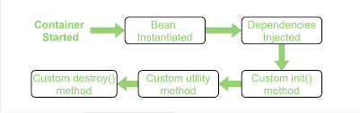
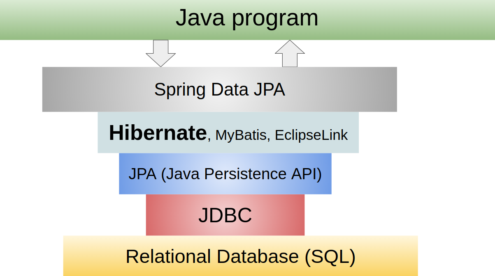

[Вопросы для собеседования](README.md)

# Spring

+ [Суть паттерна DI IOC](spring.md#Суть-паттерна-DI-IOC)
+ [Что такое Spring? Из каких частей состоит Spring Framework?](spring.md#Что-такое-Spring?-Из-каких-частей-состоит-Spring-Framework?)
+ [Что такое AOP? Как это относиться к IoC?](spring.md#Что-такое-AOP?-Как-это-относиться-к-IoC?)
+ [Какие вы знаете различные scope у Spring Bean?](spring.md#Какие-вы-знаете-различные-scope-у-Spring-Bean?)
+ [Что такое бин](spring.md#Что-такое-бин)
+ [Что такое жизненный цикл Spring Bean?](spring.md#Что-такое-жизненный-цикл-Spring-Bean?)
+ [Каким образом можно управлять транзакциями в Spring?](spring.md#Каким-образом-можно-управлять-транзакциями-в-Spring?)
+ [Какая разница между аннотациями @Component, @Repository и @Service в Spring?](spring.md#Какая-разница-между-аннотациями-@Component,-@Repository-и-@Service-в-Spring?)
+ [Чем отличается Bean от Component](spring.md#Чем-отличается-Bean-от-Component)
+ [В чём состоит различие между Spring и Spring Boot?](spring.md#В-чём-состоит-различие-между-Spring-и-Spring-Boot?)
+ [@Transactional](spring.md#@Transactional)
+ [Разница между JDBC, JPA, Hibernate, Spring Data Jpa](spring.md#JDBC,-JPA,-Hibernate,-Spring-Data-Jpa)

## Суть паттерна DI IOC
IoC - аутсорсинг созадния и управления объектами. Т.е. передача программистом прав на создание
и управление объектами Спрнинг

DI - аутсорсинг добавление/внедрение зависимостей. DI делает объекты нашего приложения 
слобосвязанными

[к оглавлению](#Spring)

## Что такое Spring? Из каких частей состоит Spring Framework?
Spring - фреймворк с открытым исходным кодом, предназначеный для упрощения разработки enterprise-приложений. Одним из главным преимуществом Spring является его слоистая архитектура, позволяющая вам самим определять какие компоненты будут использованы в вашем приложении. Модули Spring построены на базе основного контейнера, который определяет создание, конфигурация и менеджмент бинов.
Основной контейнер - предоставляет основной функционал Spring. Главным компонентом контейнера является BeanFactory - реализация паттерна Фабрика. BeanFactory позволяет разделить конфигурацию приложения и информацию о зависимостях от кода.
Spring context - конфигурационный файл, который предоставляет информация об окружающей среде для Spring. Сюда входят такие enterprise-сервисы, как JNDI, EJB, интернационализация, валиадция и т.п.
Spring AOP - отвечает за интеграцию аспектно-ориентированного программирования во фреймворк. Spring AOP обеспечивает сервис управления транзакциями для Spring-приложения.
Spring DAO - абстрактный уровень Spring JDBC DAO предоставляет иерархию исключений и множество сообщений об ошибках для разных БД. Эта иерархия упрощает обработку исключений и значительно уменьшает количество кода, которое вам нужно было бы написать для таких операций, как, например, открытие и закрытие соединения.
Spring ORM - отвечает за интеграцию Spring и таких популярных ORM-фреймворков, как Hibernate, iBatis и JDO.
Spring Web module - классы, которые помогают упростить разработку Web (авторизация, доступ к бинам Spring-а из web).

[к оглавлению](#Spring)

## Что такое AOP? Как это относиться к IoC?
Аспектно-ориентированное программирование (АОП) - парадигма программирования, основанная на идее разделения 
функциональности для улучшения разбиения программы на модули. AOP и Spring - взаимодополняющие технологии, 
которые позволяют решать сложные проблемы путем разделения функционала на отдельные модули. АОП предоставляет 
возможность реализации сквозной логики - т.е. логики, которая применяется к множеству частей приложения - в 
одном месте и обеспечения автоматического применения этой логики по всему приложению. Подход Spring к АОП 
заключается в создании "динамических прокси" для целевых объектов и "привязывании" объектов к 
конфигурированному совету для выполнения сквозной логики.

[к оглавлению](#Spring)

## Какие вы знаете различные scope у Spring Bean?

В Spring предусмотрены различные области времени действия бинов:

__Singleton__ может быть создан только один экземпляр бина. Этот тип используется спрингом по умолчанию, если не указано другое.
Следует осторожно использовать публичные свойства класса, т.к. они не будут потокобезопасными.

__Prototype__ создается новый экземпляр при каждом запросе.

__Request__ аналогичен prototype, но название служит пояснением к использованию бина в веб приложении. 
Создается новый экземпляр при каждом HTTP request.

__Session__ новый бин создается в контейнере при каждой новой HTTP сессии.
global-session: используется для создания глобальных бинов на уровне сессии для Portlet  приложений.

[к оглавлению](#Spring)

## Что такое бин

В Spring-е бином (bean) называют любой класс, который управляется контейнером Spring. 
То есть такими вещами, как создание экземпляра бина, его инициализация, внедрение 
зависимостей и параметров, деинициализация, генерация всевозможных оберток над бином, 
занимается не ваш код, а IoC-контейнер Spring-а.

[к оглавлению](#Spring)

## Что такое жизненный цикл Spring Bean?

Жизненный цикл Spring Bean - время существования класса. Spring бины инициализируются при инициализации Spring контейнера и происходит внедрение 
всех зависимостей. Когда контейнер уничтожается, то уничтожается и всё содержимое. Если нам необходимо задать 
какое-либо действие при инициализации и уничтожении бина, то нужно воспользоваться методами init() и destroy(). 
Для этого можно использовать аннотации @PostConstruct и @PreDestroy().

[к оглавлению](#Spring)

## Каким образом можно управлять транзакциями в Spring?

Транзакциями в Spring управляют с помощью Declarative Transaction Management (программное управление). 
Используется аннотация @Transactional для описания необходимости управления транзакцией. В файле конфигурации 
нужно добавить настройку transactionManager для DataSource.

[к оглавлению](#Spring)

## Какая разница между аннотациями @Component, @Repository и @Service в Spring?

__@Component__ - используется для указания класса в качестве компонента spring. При использовании поиска аннотаций, 
такой класс будет сконфигурирован как spring bean.

__@Controller__ - специальный тип класса, применяемый в MVC приложениях. Обрабатывает запросы и часто используется 
с аннотацией @RequestMapping.

__@Repository__ - указывает, что класс используется для работы с поиском, получением и хранением данных. Аннотация 
может использоваться для реализации шаблона DAO.

__@Service__ - указывает, что класс является сервисом для реализации бизнес логики (на самом деле не отличается от 
Component, но просто помогает разработчику указать смысловую нагрузку класса).

Для указания контейнеру на класс-бин можно использовать любую из этих аннотаций. Но различные имена позволяют 
различать назначение того или иного класса.

[к оглавлению](#Spring)

##  Чем отличается Bean от Component
__@Component (и @Service и @Repository)__ используются для автоматического обнаружения и 
автоматической настройки beans с помощью сканирования пути к классам. Существует неявное
взаимно однозначное сопоставление между аннотированным классом и bean 
(т.е. Один bean для каждого класса). Управление проводкой довольно ограничено этим 
подходом, поскольку оно чисто декларативное.

__@Bean__ используется для явного объявления одного bean, а не для Spring делать это 
автоматически, как указано выше. Он отделяет объявление bean от определения класса и 
позволяет вам создавать и настраивать beans точно, как вы выбираете. @Bean аннотация 
возвращает объект, который spring должен регистрироваться как bean в контексте 
приложения. тело метода несет логику, ответственную за создание экземпляра.

[к оглавлению](#Spring)

## В чём состоит различие между Spring и Spring Boot?
__Spring Boot__ – это один из многочисленных проектов экосистемы Spring, но в отличие от большинства 
своих «собратьев» он не решает какую-либо конкретную задачу, а представляет собой скорее новый этап
развития Spring в целом.

Цель Spring Boot состоит в том, чтобы упростить процесс разработки приложений на основе Spring при
помощи их создания на основе уже готовых «наборов» программных компонентов (так называемых, 
«starter» пакетов), которые уже включают «джентельменский» набор того, что необходимо для решения
той или иной задачи и сконфигурированы соответствующим образом.

Это избавляет программиста не только от написания длинных конфигурационных файлов (особенно в XML),
но и от необходимости настраивать различные компоненты для совместной работы. Что позволяет 
сосредоточиться на написании прикладного кода.

Если конфигурация по умолчанию, вас в чём-то не устраивает, также можно самостоятельно сконфигурировать
нужные компоненты написав соответствующий класс конфигурации. Конфигурации из этого класса переопределит
конфигурацию, заданную по умолчанию для соответствующих компонентов, что позволяет в случае необходимости
полностью настроить приложение «под проект».

__Наиболее часто используемые starter пакеты:__

__Spring boot starter web__ 

Включает компоненты для создания web приложений или backend REST сервисов (работает на основе Spring MVC);

__Spring boot starter data JPA__

Включает компоненты для работы с базами данных в соответствии с подходом ORM (работает на основе 
Hibernate);

__Spring boot starter test__

Включает компоненты для автоматизированного (Unit) тестирования приложений (работает на основе Junit и Mockito).
Это далеко не всё, что может предложить Spring Boot на сегодняшний день. Существуют также starter
пакеты для многих других задач. Например, выполнения заданий по расписанию (на основе Spring Quartz),
работы с электронной почтой, диагностики работы приложений и т.д.

Также Spring Boot включается в себя переносную версию сервера приложений Tomcat. Что даёт собирать 
standalone приложения и тем самым обойтись без развёртывания специального сервера для работы 
приложений и значительно упрощает их контейнеризацию в тот же Docker.

В настоящее время Spring Boot уже почти полностью вытеснил «классические» приложения Spring в 
качестве основы для новых проектов.

[к оглавлению](#Spring)

## Transactional

__Транзакцией__ называется набор связанных операций, все из которых должны быть выполнены
корректно без ошибок. Если при выполнении одной из операций возникла ошибка, все 
остальные должны быть отменены. Прежде всего такой механизм применяется при работе с БД.

Spring предлагает очень простой декларативный способ управления транзакциями. Вам достаточно
добавить @org.springframework.transaction.annotation. Transactional к публичному сервисному
методу, и все операции внутри этого метода будут выполняться в транзакции. При выходе из 
метода транзакция будет завершена (операция commit в терминах БД) автоматически. Если в 
процессе работы возникнет исключение и оно не будет перехвачено внутри метода, транзакция
будет отменена (операция rollback) и все данные вернуться в то состояние, в котором они 
были до начала транзакции.

[к оглавлению](#Spring)

## JDBC, JPA, Hibernate, Spring Data Jpa
__JDBC__ — это мост между миром Java и миром баз данных. Ведь первое, что мы ищем когда хотим 
подключить базу данных к нашему приложению — jdbc драйвер. Если мы работаем с Maven, тогда мы 
ищем зависимость для драйвера к определенной базе.

Одним из недостатков JDBC является то, что код, который получается в конце — выглядит очень большим
по объему (хотя работы он выполняет не много). Также, очень сложно приходится, когда объект джава 
который мы пытаемся сохранить в базе или достать — достаточно большой.

JPA призвана устранить вышеперечисленные недостатки.

__Java Persistence API__ — это технология, которая позволяет удобно мапить объект Java и таблицу 
базы данных. В JDBC при написании каждого запроса, Вам необходимо указать в коде все детали, 
необходимые для операций CRUD, такие как имена таблиц, имена столбцов. В JPA (которая использует 
JDBC «под капотом») Вы также указываете эти данные, но уже только один раз, когда навешиваете 
аннотации на Java класс. Сама по себе спецификация JPA не является инструментом или фреймворком; скорее, она определяет 
набор концепций, которые могут и должны быть реализованы любым другим инструментом.
Так как JPA — это просто спецификация, Вам нужен инструмент для ее реализации. Этим инструментом 
может быть Hibernate, TopLink, iBatis и т. д.

__Hibernate__ самый популярный ORM (Object Relational Mapping) фреймворк для работы с базой данных.
Вы можете рассматривать JPA как интерфейс, а Hibernate — как реализацию. Без Hibernate, от JPA в 
Вашем коде будет мало полезности. Хотя как Hibernate так и JPA можно использовать по отдельности в 
связке с другими инструментами.

Цель Spring Data — уменьшить объем стандартного кода, необходимого для реализации уровней доступа к данным 
для различных баз данных.

__Spring Data JPA__ — это библиотека, которая добавляет дополнительный уровень абстракции поверх 
ORM реализации JPA. По умолчанию Spring Data JPA использует Hibernate, в качестве ORM провайдера 
(чтобы выполнять запросы). Это, кстати, можно изменить используя настройки Spring. Хотя делать 
это неопытным пользователям я бы не советовал.

Если Вы используете Spring Boot вместе с Spring Data JPA, то имеете все необходимые настройки 
подключения Java приложения к базе данных “из коробки”. Единственное, что нужно указать — это 
хост для Вашей базы данных, имя пользователя и пароль для доступа к ней. Spring Boot обеспечивает 
автоматическую настройку для всего подключения к базе. В том числе и пул соединений.

[к оглавлению](#Spring)
