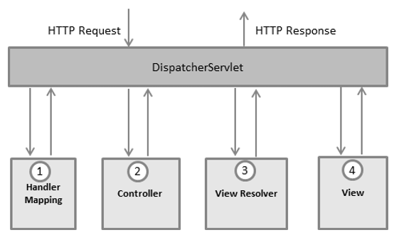

[Вопросы для собеседования](../README.md)

# Spring

+ [Суть паттерна DI IOC](spring.md#Суть-паттерна-DI-IOC)
+ [Что такое _Spring_?](spring.md#Что-такое-spring)
+ [Что такое _AOP?_ Как это относиться к _IoC?_](spring.md#Что-такое-AOP-Как-это-относиться-к-IoC)
+ [Какие вы знаете различные scope у Spring _Bean?_](spring.md#Какие-вы-знаете-различные-scope-у-Spring-Bean)
+ [Что такое _бин?_](spring.md#Что-такое-бин)
+ [Что такое жизненный цикл Spring _Bean?_](spring.md#Что-такое-жизненный-цикл-Spring-Bean)
+ [Что такое BeanPostProcessor?](spring.md#Что-такое-BeanPostProcessor)
+ [Каким образом можно управлять транзакциями в _Spring?_](spring.md#Каким-образом-можно-управлять-транзакциями-в-Spring)
+ [Какая разница между аннотациями @Component, @Repository и @Service в _Spring?_](spring.md#Какая-разница-между-аннотациями-Component-Repository-и-Service-в-Spring)
+ [Чем отличается Bean от _Component?_](spring.md#Чем-отличается-Bean-от-Component)
+ [В чём состоит различие между Spring и Spring _Boot?_](spring.md#В-чём-состоит-различие-между-Spring-и-Spring-Boot)
+ [Ключевые различия между Spring и Spring Boot Spring vs Spring Boot](spring.md#Ключевые-различия-между-Spring-и-Spring-Boot-Spring-vs-Spring-Boot)
+ [@Transactional](spring.md#Transactional)
+ [Разница между JDBC, JPA, Hibernate, Spring Data Jpa](spring.md#JDBC-JPA-Hibernate-Spring-Data-Jpa)
+ [JPA зачем надо Fetch](spring.md#JPA-зачем-надо-Fetch)
+ [Criteria API](spring.md#Criteria-API)
+ [Что такое Spring _MVC?_](spring.md#Что-такое-spring-mvc)
+ [Определение Контроллера](spring.md#определение-контроллера)
+ [@RestController vs @Controller](spring.md#RestController-vs-Controller)
+ [Spring Boot стартеры](spring.md#spring-boot-стартеры)
+ [Feign client](spring.md#feign-client )
+ [MapStruct](spring.md#mapStruct )

## Суть паттерна DI IOC
IoC - аутсорсинг созадния и управления объектами. Т.е. передача программистом прав на создание
и управление объектами Спрнинг

DI - аутсорсинг добавление/внедрение зависимостей. DI делает объекты нашего приложения 
слобосвязанными

[к оглавлению](#Spring)

## Что такое _Spring_?
Spring - фреймворк с открытым исходным кодом, предназначеный для упрощения разработки enterprise-приложений. Одним из главным преимуществом Spring является его слоистая архитектура, позволяющая вам самим определять какие компоненты будут использованы в вашем приложении. Модули Spring построены на базе основного контейнера, который определяет создание, конфигурация и менеджмент бинов.
Основной контейнер - предоставляет основной функционал Spring. Главным компонентом контейнера является BeanFactory - реализация паттерна Фабрика. BeanFactory позволяет разделить конфигурацию приложения и информацию о зависимостях от кода.
Spring context - конфигурационный файл, который предоставляет информация об окружающей среде для Spring. Сюда входят такие enterprise-сервисы, как JNDI, EJB, интернационализация, валиадция и т.п.
Spring AOP - отвечает за интеграцию аспектно-ориентированного программирования во фреймворк. Spring AOP обеспечивает сервис управления транзакциями для Spring-приложения.
Spring DAO - абстрактный уровень Spring JDBC DAO предоставляет иерархию исключений и множество сообщений об ошибках для разных БД. Эта иерархия упрощает обработку исключений и значительно уменьшает количество кода, которое вам нужно было бы написать для таких операций, как, например, открытие и закрытие соединения.
Spring ORM - отвечает за интеграцию Spring и таких популярных ORM-фреймворков, как Hibernate, iBatis и JDO.
Spring Web module - классы, которые помогают упростить разработку Web (авторизация, доступ к бинам Spring-а из web).

[к оглавлению](#Spring)

## Что такое _AOP?_ Как это относиться к _IoC?_
Аспектно-ориентированное программирование (АОП) - парадигма программирования, основанная на идее разделения 
функциональности для улучшения разбиения программы на модули. AOP и Spring - взаимодополняющие технологии, 
которые позволяют решать сложные проблемы путем разделения функционала на отдельные модули. АОП предоставляет 
возможность реализации сквозной логики - т.е. логики, которая применяется к множеству частей приложения - в 
одном месте и обеспечения автоматического применения этой логики по всему приложению. Подход Spring к АОП 
заключается в создании "динамических прокси" для целевых объектов и "привязывании" объектов к 
конфигурированному совету для выполнения сквозной логики.

[к оглавлению](#Spring)

## Какие вы знаете различные scope у Spring _Bean?_

В Spring предусмотрены различные области времени действия бинов:

__Singleton__ может быть создан только один экземпляр бина. Этот тип используется спрингом по умолчанию, если не указано другое.
Следует осторожно использовать публичные свойства класса, т.к. они не будут потокобезопасными.

__Prototype__ создается новый экземпляр при каждом запросе.

__Request__ аналогичен prototype, но название служит пояснением к использованию бина в веб приложении. 
Создается новый экземпляр при каждом HTTP request.

__Session__ новый бин создается в контейнере при каждой новой HTTP сессии.
global-session: используется для создания глобальных бинов на уровне сессии для Portlet  приложений.

[к оглавлению](#Spring)

## Что такое _бин?_

В Spring-е бином (bean) называют любой класс, который управляется контейнером Spring. 
То есть такими вещами, как создание экземпляра бина, его инициализация, внедрение 
зависимостей и параметров, деинициализация, генерация всевозможных оберток над бином, 
занимается не ваш код, а IoC-контейнер Spring-а.

[к оглавлению](#Spring)

## Что такое жизненный цикл Spring _Bean?_

Жизненный цикл Spring Bean - время существования класса. Spring бины инициализируются при инициализации Spring контейнера и происходит внедрение 
всех зависимостей. Когда контейнер уничтожается, то уничтожается и всё содержимое. Если нам необходимо задать 
какое-либо действие при инициализации и уничтожении бина, то нужно воспользоваться методами init() и destroy(). 
Для этого можно использовать аннотации @PostConstruct и @PreDestroy().


[к оглавлению](#Spring)

## Что такое BeanPostProcessor
__BeanPostProcessor__ - это интерфейс в Spring Framework, который предоставляет возможность изменять поведение бинов 
Spring до и после их инициализации. Он позволяет внедрять пользовательскую логику на различных этапах жизненного цикла бина.

Вот несколько типичных случаев, когда BeanPostProcessor может быть полезен:

1. Конфигурация: Вы можете использовать BeanPostProcessor для настройки бинов перед их использованием. Например, вы можете 
добавлять дополнительные настройки или ресурсы в бины во время их инициализации.

2. AOP (Aspect-Oriented Programming): Вы можете использовать BeanPostProcessor для применения аспектов к бинам. Например, 
вы можете обернуть бин в прокси, чтобы добавить аспекты без изменения самого бина.

3. Внедрение зависимостей: Вы можете использовать BeanPostProcessor для внедрения зависимостей динамически. Например, 
если ваш бин зависит от других бинов, которые могут быть созданы динамически, вы можете использовать BeanPostProcessor, 
чтобы внедрить эти зависимости во время инициализации бина.

4. Логирование и отладка: BeanPostProcessor может использоваться для логирования информации о созданных бинах, их типах и состоянии.

Пример использования BeanPostProcessor:
```java
import org.springframework.beans.BeansException;
import org.springframework.beans.factory.config.BeanPostProcessor;

public class CustomBeanPostProcessor implements BeanPostProcessor {

    @Override
    public Object postProcessBeforeInitialization(Object bean, String beanName) throws BeansException {
        // Логика, выполняемая перед инициализацией бина
        return bean;
    }

    @Override
    public Object postProcessAfterInitialization(Object bean, String beanName) throws BeansException {
        // Логика, выполняемая после инициализации бина
        return bean;
    }
}
```
Этот BeanPostProcessor можно затем зарегистрировать в контексте Spring для использования. Когда Spring создает и 
инициализирует бины, он автоматически применяет логику из BeanPostProcessor к ним перед и после их инициализации.

[к оглавлению](#Spring)

## Каким образом можно управлять транзакциями в _Spring?_

Транзакциями в Spring управляют с помощью Declarative Transaction Management (программное управление). 
Используется аннотация @Transactional для описания необходимости управления транзакцией. В файле конфигурации 
нужно добавить настройку transactionManager для DataSource.

[к оглавлению](#Spring)

## Какая разница между аннотациями @Component, @Repository и @Service в _Spring?_

Spring @Component, @Service, @Repository и @Controller аннотации используются для сканирования указанного класса пути, 
зарегистрированного как bean-компонент в среде Spring. @Component - это общая аннотация.
Разница между @Service, @Repository, @Controller и @Component заключается в том, что они являются частными случаями 
@Component и используются для определенных целей. Разница только в классификации.

__@Component__ - используется для указания класса в качестве компонента spring. При использовании поиска аннотаций, 
такой класс будет сконфигурирован как spring bean.

__@Controller__ - специальный тип класса, применяемый в MVC приложениях. Обрабатывает запросы и часто используется 
с аннотацией @RequestMapping.

__@Repository__ - указывает, что класс используется для работы с поиском, получением и хранением данных. Аннотация 
может использоваться для реализации шаблона DAO.

__@Service__ - указывает, что класс является сервисом для реализации бизнес логики (на самом деле не отличается от 
Component, но просто помогает разработчику указать смысловую нагрузку класса).

Для указания контейнеру на класс-бин можно использовать любую из этих аннотаций. Но различные имена позволяют 
различать назначение того или иного класса.

[к оглавлению](#Spring)

##  Чем отличается Bean от _Component?_
__@Component (и @Service и @Repository)__ используются для автоматического обнаружения и 
автоматической настройки beans с помощью сканирования пути к классам. Существует неявное
взаимно однозначное сопоставление между аннотированным классом и bean 
(т.е. Один bean для каждого класса). Управление проводкой довольно ограничено этим 
подходом, поскольку оно чисто декларативное.

__@Bean__ используется для явного объявления одного bean, а не для Spring делать это 
автоматически, как указано выше. Он отделяет объявление bean от определения класса и 
позволяет вам создавать и настраивать beans точно, как вы выбираете. @Bean аннотация 
возвращает объект, который spring должен регистрироваться как bean в контексте 
приложения. тело метода несет логику, ответственную за создание экземпляра.

[к оглавлению](#Spring)

## В чём состоит различие между Spring и Spring _Boot?_
__Spring Boot__ – это один из многочисленных проектов экосистемы Spring, но в отличие от большинства 
своих «собратьев» он не решает какую-либо конкретную задачу, а представляет собой скорее новый этап
развития Spring в целом.

Цель Spring Boot состоит в том, чтобы упростить процесс разработки приложений на основе Spring при
помощи их создания на основе уже готовых «наборов» программных компонентов (так называемых, 
«starter» пакетов), которые уже включают «джентельменский» набор того, что необходимо для решения
той или иной задачи и сконфигурированы соответствующим образом.

Это избавляет программиста не только от написания длинных конфигурационных файлов (особенно в XML),
но и от необходимости настраивать различные компоненты для совместной работы. Что позволяет 
сосредоточиться на написании прикладного кода.

[к оглавлению](#Spring)

## Ключевые различия между Spring и Spring Boot Spring vs Spring Boot

**Spring** — это большой набор библиотек и фреймворков  
(Core, DI, MVC, Data, Security и др.).

**Spring Boot** — надстройка над Spring, которая убирает ручную настройку  
и даёт **«запуск из коробки»**.

---

### Чем Spring Boot удобнее

### Автоконфигурация
Spring Boot автоматически настраивает бины на основе:
- зависимостей в `classpath`
- параметров конфигурации

Пример:  
подключил `spring-boot-starter-data-jpa` → автоматически появляются  
`EntityManager`, `DataSource`, транзакции и т.д.

---

### Starters
Готовые **пакеты зависимостей** под конкретную задачу:
- `web`
- `security`
- `data-jpa`
- `test`

➡️ Избавляют от ручного подбора и согласования версий библиотек.

---

### Встроенный сервер
Tomcat / Jetty / Netty встроены в приложение.

### Единый конфиг
- `application.yml / application.properties`
- `профили: dev, prod`
- `удобная работа с переменными окружения`


### Управление зависимостями
- `фиксирует совместимые версии`
- `уменьшает dependency hell`
- `упрощает обновления`

### Когда выбирать Spring Boot

Выбирай **Spring Boot почти всегда**, если ты:

- пишешь микросервис / REST API / веб-приложение / интеграционный сервис;
- хочешь быстрый старт и стандартную архитектуру;
- нуждаешься в production-фичах:
   - health checks
   - metrics
   - конфиги по окружениям
   - удобный деплой;
- не хочешь тратить время на ручную сборку инфраструктуры проекта.

➡️ **Это дефолтный выбор для современной разработки на Spring.**

---

### Когда выбирать «чистый Spring» (без Boot)

Имеет смысл, если:

- нужен очень строгий контроль над конфигурацией и процессом старта  
  (например, внутренний платформенный фреймворк компании);
- приложение разворачивается во внешний application server  
  по корпоративным требованиям  
  (хотя Spring Boot умеет это через WAR);
- требуется минимальная «магия» и полностью явная конфигурация  
  (для обучения или специфичных сред);
- ты пишешь библиотеку или SDK, а не конечное приложение  
  (Spring Boot в этом случае чаще лишний).

---

### Важный нюанс

Spring Boot **не заменяет Spring** — он использует Spring и просто:

- добавляет автоконфигурацию;
- задаёт разумные дефолты;
- упрощает зависимости и запуск.


[к оглавлению](#Spring)


## @Transactional

Аннотация __@Transactional__ — это механизм управления транзакциями, чаще всего используемый в Spring-приложениях, который 
позволяет автоматически открывать, фиксировать (commit) или откатывать (rollback) транзакции при выполнении методов.
---

### Что такое транзакция (кратко)

Транзакция — это логическая единица работы с данными, которая должна соответствовать принципам ACID:

- Atomicity — либо всё выполняется, либо ничего
- Consistency — данные остаются согласованными
- Isolation — параллельные транзакции не мешают друг другу
- Durability — зафиксированные данные не теряются


Spring предлагает очень простой декларативный способ управления транзакциями. Вам достаточно
добавить @org.springframework.transaction.annotation. Transactional к публичному сервисному
методу, и все операции внутри этого метода будут выполняться в транзакции. При выходе из 
метода транзакция будет завершена (операция commit в терминах БД) автоматически. Если в 
процессе работы возникнет исключение и оно не будет перехвачено внутри метода, транзакция
будет отменена (операция rollback) и все данные вернуться в то состояние, в котором они 
были до начала транзакции.

Предположим, у нас есть метод в спринговом сервисе, который выполняет несколько запросов в БД. Для простоты можно 
использовать Spring Data, чтобы оперировать записями в БД в ООП стиле.

Сама сущность, которую мы сохраняем в базу, имеет следующий вид:

```java
@Entity
public class Record {

    @Id
    @GeneratedValue(strategy = GenerationType.IDENTITY)
    private int id;
    private String name;

    // get- и set-методы...
}
```
Слой dao, представляющий базовые методы для сохранения данной сущности в БД выглядит так:

```java
public interface ExampleDao extends CrudRepository<Record, Integer> {
}
```

Теперь создадим метод в сервисном слое, который сначала создаёт сущность, сохраняет её в БД, затем обновляет её имя. 
То есть сначала в БД происходит запрос insert, затем update.

```java
@Service
public class ExampleService {

    private final ExampleDao exampleDao;

    public ExampleService(ExampleDao exampleDao) {
        this.exampleDao = exampleDao;
    }

    public void doTransaction() {
        var record = new Record();
        record.setName("created");
        exampleDao.save(record); // insert
        record.setName("updated");
        exampleDao.save(record); // update
    }
}
```
Сервисный метод вызывается из контроллера при помощи POST-запроса:

```java
@RestController
public class ExampleController {

    private final ExampleService exampleService;

    public ExampleController(ExampleService exampleService) {
        this.exampleService = exampleService;
    }

    @PostMapping
    public void doTransaction() {
        exampleService.doTransaction();
    }
}
```

Данный код всегда работает без ошибок. А теперь добавим между созданием и обновлением записи в БД ошибку.

```java
public void doTransaction() {
    var record = new Record();
    record.setName("created");
    exampleDao.save(record);
    if (record.getId() > 0) {
        throw new RuntimeException();
    }
    record.setName("updated");
    exampleDao.save(record);
}
```

Если мы выполним данный код, то увидим, что новая запись была добавлена в таблицу, но до обновления дело уже не дошло. 
Чтобы держать наши данные согласованными, достаточно добавить к методу вышеупомянутую аннотацию:

```java
@Transactional
public void doTransaction() {
    var record = new Record();
    record.setName("created");
    exampleDao.save(record);
    if (record.getId() > 0) {
        throw new RuntimeException();
    }
    record.setName("updated");
    exampleDao.save(record);
}
```

В данном случае первый запрос будет выполнен, а потом отменён и в таблице в БД новых записей так и не появится.

Бывают такие ошибки, при которых откатывать транзакцию не требуется. Эти исключения вы можете перечислить при помощи 
параметра dontRollbackOn:

```java
@Transactional(dontRollbackOn = {RuntimeException.class})
```
Если мы сделаем так для нашего примера, то запись всё-таки будет создана, затем возникнет исключение, обновления уже не произойдёт, но транзакция всё равно будет завершена.

Как Spring реализует механизм создания транзакций? Важно отметить, что @Transactional будет работать только для публичных
методов, вызываемых из других компонентов. Это происходит потому что спринг делает вызов целевого метода через прокси-объект, 
имеющий такой же интерфейс, как и наш сервис. В этом прокси-объекте происходит открытие транзакции перед вызовом целевого 
метода. Затем, после завершения целевого метода, происходит закрытие транзакции. Если из метода вылетит исключение, 
транзакция будет отменена. Это поведение похоже на конструкцию try-catch. Можно представлять себе логику работы прокси так:

```java
try {
    // открытие транзакции
    // вызов целевого метода
    // commit
} catch (Exception e) {
    // rollback
}
```

Если вы повесите @Transactional на какой-либо метод и вызовете его из того же сервиса, но из другого метода, механизм 
работать не будет, т.к. вызов не проходит через прокси. Это надо иметь в виду.

```java
@Service
public class ExampleService {

    public void doWrongTransaction() {
        doTransaction(); // так транзакция работать не будет!
    }

    @Transactional
    public void doTransaction() {
        // работа с БД
    }
}
```

Взято от сюда (https://devmark.ru/article/spring-transaction-management)


[к оглавлению](#Spring)

## JDBC, JPA, Hibernate, Spring Data Jpa
__JDBC__ — это мост между миром Java и миром баз данных. Ведь первое, что мы ищем когда хотим 
подключить базу данных к нашему приложению — jdbc драйвер. Если мы работаем с Maven, тогда мы 
ищем зависимость для драйвера к определенной базе.

Одним из недостатков JDBC является то, что код, который получается в конце — выглядит очень большим
по объему (хотя работы он выполняет не много). Также, очень сложно приходится, когда объект джава 
который мы пытаемся сохранить в базе или достать — достаточно большой.

JPA призвана устранить вышеперечисленные недостатки.

__Java Persistence API__ — это технология, которая позволяет удобно мапить объект Java и таблицу 
базы данных. В JDBC при написании каждого запроса, Вам необходимо указать в коде все детали, 
необходимые для операций CRUD, такие как имена таблиц, имена столбцов. В JPA (которая использует 
JDBC «под капотом») Вы также указываете эти данные, но уже только один раз, когда навешиваете 
аннотации на Java класс. Сама по себе спецификация JPA не является инструментом или фреймворком; скорее, она определяет 
набор концепций, которые могут и должны быть реализованы любым другим инструментом.
Так как JPA — это просто спецификация, Вам нужен инструмент для ее реализации. Этим инструментом 
может быть Hibernate, TopLink, iBatis и т. д.

__Hibernate__ самый популярный ORM (Object Relational Mapping) фреймворк для работы с базой данных.
Вы можете рассматривать JPA как интерфейс, а Hibernate — как реализацию. Без Hibernate, от JPA в 
Вашем коде будет мало полезности. Хотя как Hibernate так и JPA можно использовать по отдельности в 
связке с другими инструментами.

Цель Spring Data — уменьшить объем стандартного кода, необходимого для реализации уровней доступа к данным 
для различных баз данных.

__Spring Data JPA__ — это библиотека, которая добавляет дополнительный уровень абстракции поверх 
ORM реализации JPA. По умолчанию Spring Data JPA использует Hibernate, в качестве ORM провайдера 
(чтобы выполнять запросы). Это, кстати, можно изменить используя настройки Spring. Хотя делать 
это неопытным пользователям я бы не советовал.

Если Вы используете Spring Boot вместе с Spring Data JPA, то имеете все необходимые настройки 
подключения Java приложения к базе данных “из коробки”. Единственное, что нужно указать — это 
хост для Вашей базы данных, имя пользователя и пароль для доступа к ней. Spring Boot обеспечивает 
автоматическую настройку для всего подключения к базе. В том числе и пул соединений.


[к оглавлению](#Spring)

## JPA зачем надо Fetch
Fetch в JPA (Java Persistence API) используется для определения стратегии загрузки связанных сущностей из базы данных. 
Когда у вас есть объект сущности, который имеет связь с другими сущностями (например, связь многие-к-одному или один-к-одному),
fetch позволяет указать, когда и как эти связанные сущности должны быть загружены.

Fetch определяет, будут ли связанные сущности загружены сразу при загрузке основной сущности или только при обращении к ним.
Он влияет на производительность и объем данных, передаваемых между базой данных и приложением. Стратегия fetch может быть 
eager (сразу) или lazy (по требованию).

Eager fetch (жадная загрузка) загружает связанные сущности сразу при загрузке основной сущности. Это может быть полезно, 
если вы уверены, что всегда будете использовать связанные сущности вместе с основной сущностью, но это также может привести
к избыточной загрузке данных. Lazy fetch (ленивая загрузка) загружает связанные сущности только тогда, когда они 
запрашиваются из кода. Это может улучшить производительность приложения, особенно если связанные сущности редко используются.
Выбор между eager и lazy fetch зависит от конкретных требований приложения и оптимизации производительности.

[к оглавлению](#Spring)

## Criteria API
Criteria API - это набор классов и методов в Java, предназначенный для создания динамических запросов к базе данных в JPA
(Java Persistence API). Он предоставляет возможность создавать запросы без явного написания SQL-запросов в строках.
Зачем нужно использовать Criteria API:
- Безопасность типов: Criteria API работает с объектами и типами данных, что позволяет выявлять ошибки на этапе компиляции, 
а не во время выполнения программы. Это делает код более надежным и менее подверженным ошибкам.
- Поддержка динамических запросов: Criteria API позволяет строить запросы динамически в зависимости от условий, что 
особенно полезно, когда фильтры или условия запроса определяются во время выполнения программы.
- Поддержка метамодели: Criteria API использует метамодель для доступа к атрибутам сущностей без использования строковых
имен полей, что делает код более читаемым и поддерживаемым.

Как использовать Criteria API:

- Получение CriteriaBuilder: Сначала нужно получить экземпляр CriteriaBuilder из EntityManager. Этот объект используется
для создания критериев запроса и предикатов.
- Создание CriteriaQuery: Затем создается объект CriteriaQuery, который представляет собой корневой запрос. Он указывает,
какие сущности вы хотите получить из базы данных.
- Добавление условий и фильтров: Используя CriteriaBuilder, вы можете создавать предикаты (условия) и добавлять их к 
CriteriaQuery. Это позволяет фильтровать результаты запроса в соответствии с вашими требованиями.
- Выполнение запроса: И наконец, запрос выполняется с помощью EntityManager, который получает запрос CriteriaQuery и возвращает результат.

Пример:
```java
CriteriaBuilder cb = entityManager.getCriteriaBuilder();
CriteriaQuery<Employee> query = cb.createQuery(Employee.class);

Root<Employee> root = query.from(Employee.class);
query.select(root);

// Добавление условия
query.where(cb.equal(root.get("department"), "IT"));

List<Employee> result = entityManager.createQuery(query).getResultList();

```
Это простой пример, который выбирает всех сотрудников из отдела IT. С Criteria API вы можете строить более сложные запросы,
используя различные методы CriteriaBuilder для создания предикатов и условий.

[к оглавлению](#Spring)

## Что такое Spring _MVC?_


Фреймворк Spring MVC обеспечивает архитектуру паттерна Model — View — Controller (Модель — Отображение (далее — Вид) — Контроллер) 
при помощи слабо связанных готовых компонентов. Паттерн MVC разделяет аспекты приложения (логику ввода, бизнес-логику и логику UI), 
обеспечивая при этом свободную связь между ними.

* **Model** (Модель) инкапсулирует (объединяет) данные приложения, в целом они будут состоять из POJO («Старых добрых 
  Java-объектов», или бинов).


* **View** (Отображение, Вид) отвечает за отображение данных Модели, — как правило, генерируя HTML, которые мы видим в своём браузере.


* **Controller** (Контроллер) обрабатывает запрос пользователя, создаёт соответствующую Модель и передаёт её для отображения в Вид.


## DispatcherServlet

Вся логика работы Spring MVC построена вокруг DispatcherServlet, который принимает и обрабатывает все HTTP-запросы 
(из UI) и ответы на них. Рабочий процесс обработки запроса DispatcherServlet'ом проиллюстрирован на следующей диаграмме:



1. После получения HTTP-запроса DispatcherServlet обращается к интерфейсу HandlerMapping, который определяет, какой 
   Контроллер должен быть вызван, после чего, отправляет запрос в нужный Контроллер.
   

2. Контроллер принимает запрос и вызывает соответствующий служебный метод, основанный на GET или POST. Вызванный метод 
   определяет данные Модели, основанные на определённой бизнес-логике и возвращает в DispatcherServlet имя Вида (View).


3. При помощи интерфейса ViewResolver DispatcherServlet определяет, какой Вид нужно использовать на основании полученного имени.


4. После того, как Вид (View) создан, DispatcherServlet отправляет данные Модели в виде атрибутов в Вид, который в 
   конечном итоге отображается в браузере.

Все вышеупомянутые компоненты, а именно, HandlerMapping, Controller и ViewResolver, являются частями интерфейса 
WebApplicationContext extends ApplicationContext, с некоторыми дополнительными особенностями, необходимыми для создания 
web-приложений.

(Взято от сюда https://habr.com/ru/post/336816/)

[к оглавлению](#Spring)

## Определение Контроллера

DispatcherServlet отправляет запрос контроллерам для выполнения определённых функций. Аннотация @Controllerannotation 
указывает, что конкретный класс является контроллером. Аннотация @RequestMapping используется для мапинга (связывания)
с URL для всего класса или для конкретного метода обработчика.

```java
@Controller
@RequestMapping("/hello")
public class HelloController { 
   @RequestMapping(method = RequestMethod.GET)
   public String printHello(ModelMap model) {
      model.addAttribute("message", "Hello Spring MVC Framework!");
      return "hello";
   }
}
```

Аннотация Controller определяет класс как Контроллер Spring MVC. В первом случае, @RequestMapping указывает, что все 
методы в данном Контроллере относятся к URL-адресу "/hello". Следующая аннотация @RequestMapping(method = RequestMethod.GET)
используется для объявления метода printHello() как дефолтного метода для обработки HTTP-запросов GET (в данном Контроллере).
Вы можете определить любой другой метод как обработчик всех POST-запросов по данному URL-адресу.

Вы можете написать вышеуказанный Контроллер по-другому, указав дополнительные атрибуты для аннотации @RequestMapping следующим образом:

```java
@Controller
public class HelloController {
   @RequestMapping(value = "/hello", method = RequestMethod.GET)
   public String printHello(ModelMap model) {
      model.addAttribute("message", "Hello Spring MVC Framework!");
      return "hello";
   }
}
```

Атрибут «value» указывает URL, с которым мы связываем данный метод (value = "/hello"), далее указывается, что этот метод
будет обрабатывать GET-запросы (method = RequestMethod.GET). Также, нужно отметить важные моменты в отношении приведённого
выше контроллера:

* Вы определяете бизнес-логику внутри связанного таким образом служебного метода. Из него Вы можете вызывать любые другие методы.


* Основываясь на заданной бизнес-логике, в рамках этого метода Вы создаёте Модель (Model). Вы можете добавлять аттрибуты 
  Модели, которые будут добавлены в Вид (View). В примере выше мы создаём Модель с атрибутом «message».


* Данный служебный метод возвращает имя Вида в виде строки String. В данном случае, запрашиваемый Вид имеет имя «hello».

[к оглавлению](#Spring)
## @RestController vs @Controller
Аннотация ``@RestController`` в Spring MVC — это не что иное, как сочетание аннотации ``@Controller`` и ``@ResponseBody``. 
Он был добавлен в Spring 4.0 для упрощения разработки веб-служб RESTful в среде Spring. Если вы знакомы с веб-службами REST, 
вы знаете, что принципиальное различие между веб-приложением и API-интерфейсом REST заключается в том, что ответ 
веб-приложения представляет собой общий вид HTML + CSS + JavaScript, тогда как API-интерфейс REST просто возвращает 
данные в форме JSON или XML. Эта разница также очевидна в аннотации ``@Controller`` и ``@RestController``. 
Задача ``@Controller`` — создать карту объекта модели и найти представление, но @RestController просто возвращает объект, 
и данные объекта напрямую записываются в HTTP-ответ в виде JSON или XML.

Это также можно сделать с помощью традиционного ``@Controller`` и использования аннотации ``@ResponseBody`` но так как это
стандартное поведение веб-сервисов RESTful, Spring представил ``@RestController`` который сочетал в себе поведение 
``@Controller`` и ``@ResponseBody``.

Вкратце, следующие два фрагмента кода в Spring MVC равны:

```java

@Controller
@ResponseBody
public class MVCController {
   .. your logic
}

@RestController
public class RestFulController {
  .... your logic
}
```


[к оглавлению](#Spring)

## Spring Boot стартеры

Стартеры - это набор удобных дескрипторов зависимостей, которые вы можете включить в свое приложение. Вы получаете 
универсальный набор для всех необходимых вам Spring и связанных с ними технологий без необходимости искать примеры кода 
и копировать и вставлять множество дескрипторов зависимостей. Например, если вы хотите начать использовать Spring и JPA 
для доступа к базе данных, включите в ваш проект зависимость spring-boot-starter-data-jpa.

Стартеры содержат множество зависимостей, которые необходимы вам для быстрого запуска и запуска проекта с согласованным,
поддерживаемым набором управляемых переходных зависимостей.

### Что указывается в имени стартера
Все официальные стартеры следуют аналогичной схеме именования; spring-boot-starter-*, где * это конкретный тип приложения.
Эта структура наименования предназначена, чтобы помочь, когда вам нужно найти стартер. Интеграция Maven во многие IDE 
позволяет вам искать зависимости по имени. Например, если установлен соответствующий плагин Eclipse или STS, вы можете 
нажать ctrl-space в редакторе POM и набрать "spring-boot-starter" для получения полного списка.

Сторонние стартеры не должны начинаться с spring-boot, поскольку они зарезервированы для официальных артефактов 
Spring Boot. Скорее, сторонний стартер обычно начинается с названия проекта. Например, сторонний стартер проекта под 
названием thirdpartyproject обычно будет называться thirdpartyproject-spring-boot-starter.

| Имя |	Описание  |
|--------------|--------------|
| spring-boot-starter | Core starter, включающий поддержку автоконфигурации, логирование и YAML|
| spring-boot-starter-oauth2-client	| Starter для использования возможностей Spring Security OAuth2/OpenID Connect клиента |
| spring-boot-starter-web	| Starter для создания web, включая RESTful, приложений, используя Spring MVC. Использует Tomcat как встроенный контейнер по умолчанию |


[к оглавлению](#Spring)
## Feign client
Полезная статья про Feign (https://java-master.ru/vvedenie-v-spring-cloud-openfeign/)
_Feign_ - это декларативный HTTP-клиент, который интегрируется непосредственно с библиотекой Spring, предназначенный для 
облегчения создания HTTP API клиентов. Он предлагает более удобный и чистый способ работы с удаленными HTTP-сервисами 
по сравнению с использованием более низкоуровневых библиотек, таких как HttpClient.

Вот как Feign облегчает работу:

1. Декларативные интерфейсы: Feign позволяет определять интерфейсы для взаимодействия с удаленными API, используя аннотации 
Spring. Это позволяет вам сосредоточиться на бизнес-логике вашего приложения, а не на деталях взаимодействия с HTTP.

2. Интеграция с Ribbon: Feign интегрируется с Ribbon, балансировщиком нагрузки от Netflix, что позволяет легко настраивать
и использовать клиентские стороны для выполнения запросов к различным экземплярам сервисов.

3. Интеграция с Eureka: Feign также интегрируется с Eureka, сервисом реестра от Netflix, который облегчает обнаружение и 
связывание с удаленными службами

```java
import org.springframework.cloud.openfeign.FeignClient;
import org.springframework.web.bind.annotation.GetMapping;

@FeignClient(name = "example", url = "https://api.example.com")
public interface ExampleClient {
    @GetMapping("/resource")
    String getResource();
}
```


Feign предоставляет различные способы обработки ошибок, возникающих во время выполнения HTTP-запросов. Вот несколько подходов:

1. Использование классов-оберток для ошибок: Вы можете создать класс-обертку для ошибок, которые могут возникнуть при
вызове удаленного сервиса, и возвращать эту обертку из ваших методов Feign. Это позволяет вам более детально описывать 
типы ошибок и обрабатывать их соответствующим образом в вашем коде.

```java
import org.springframework.web.bind.annotation.ResponseStatus;

@ResponseStatus(HttpStatus.INTERNAL_SERVER_ERROR)
public class RemoteServiceException extends RuntimeException {
    public RemoteServiceException(String message) {
        super(message);
    }
}
```

2. Использование аннотации @ErrorDecoder: Feign позволяет вам определять пользовательские декодеры ошибок с помощью аннотации
@ErrorDecoder. Вы можете создать класс, реализующий интерфейс ErrorDecoder, чтобы настроить, какие исключения выбрасываются 
при различных статусах ответа сервера.

```java
import feign.Response;
import feign.codec.ErrorDecoder;

public class CustomErrorDecoder implements ErrorDecoder {
    @Override
    public Exception decode(String methodKey, Response response) {
        if (response.status() == 404) {
            return new ResourceNotFoundException("Resource not found");
        }
        return new Exception("Generic error occurred");
    }
}

```

```java
import org.springframework.cloud.openfeign.FeignClient;
import org.springframework.cloud.openfeign.FeignClientConfiguration;
import org.springframework.context.annotation.Bean;
import org.springframework.context.annotation.Configuration;
import feign.codec.ErrorDecoder;

@Configuration
public class FeignConfig {
    @Bean
    public ErrorDecoder errorDecoder() {
        return new CustomErrorDecoder();
    }
}

@FeignClient(name = "example", url = "https://api.example.com", configuration = FeignConfig.class)
public interface ExampleClient {
    // Methods
}

```
[к оглавлению](#Spring)

## MapStruct

ChatGPT
MapStruct - это фреймворк для преобразования объектов в Java. Он позволяет автоматически генерировать код преобразования
между Java объектами без необходимости явного написания этого кода. Это особенно полезно в приложениях, где часто требуется
преобразование между объектами различных слоев, например, между сущностями базы данных и DTO (Data Transfer Object).

Вот основные преимущества MapStruct:

1. Простота использования: MapStruct использует аннотации Java для указания преобразований между объектами, что делает 
его простым в использовании и понимании.

2. Высокая производительность: Генерируемый MapStruct код выполняется намного быстрее, чем рефлексивные преобразования, 
поскольку он напрямую работает с полями объектов.

3. Контроль над преобразованиями: MapStruct позволяет настраивать преобразования, указывая свойства объектов, которые 
нужно игнорировать, а также применяя пользовательские методы для сложных преобразований.

4. Гибкость: MapStruct поддерживает различные сценарии преобразования, включая один-к-одному, один-ко-многим и многие-к-одному отображения.

[к оглавлению](#Spring)
